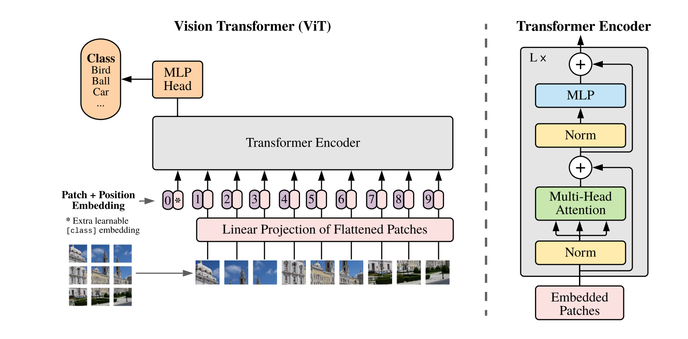

# Visiton Transformer with Pytorch

Pytorch implementation of [AN IMAGE IS WORTH 16X16 WORDS:
TRANSFORMERS FOR IMAGE RECOGNITION AT SCALE](https://openreview.net/pdf?id=YicbFdNTTy)




## Requirements
- python >= 3.6.11
- torch == 1.6.0
- transformers == 3.3.1


## Usage
- Model architecture
    - based on BERTConfig
    - addtional config
        - image_size : crop image size
        - patch_size : partial image size
        - max_position_embedinngs : patch_size * patch_size + 1(cls token)
    - config/vit-config.json 
        - For Caltech 256 Case
        - if you use another data, you should change num_classes
    ```
    {
        "attention_probs_dropout_prob": 0.1,
        "hidden_act": "gelu",
        "hidden_dropout_prob": 0.1,
        "hidden_size": 768,
        "initializer_range": 0.02,
        "intermediate_size": 3072,
        "layer_norm_eps": 1e-12,
        "max_position_embeddings": 257,
        "model_type": "bert",
        "num_attention_heads": 12,
        "num_hidden_layers": 12,
        "image_size": 256,
        "patch_size": 16,
        "num_classes": 258
      }
    ```

- Data format
    - based on torchvision.datasets.ImageFolder
    - A generic data loader where the images are arranged in this way:
    ```
    root/dog/xxx.png
    root/dog/xxy.png
    root/dog/xxz.png

    root/cat/123.png
    root/cat/nsdf3.png
    root/cat/asd932_.png
    ```

## Train Model
- argument
    - data_root : image data path
    - config : model config file path
    - gpus : # of gpus
    - batch_size : batch size
    - num_train_epochs : total train epochs
    - learning_rate : learning rate
    - save_last : save model every epoch end
    - output_dir : save model binary path

- example
```
python trainer.py --data_root ../256_ObjectCategories  --config config/vit-base-onfig.json  --gpus 2 --batch_size 16 --num_train_epochs 2-- --learning_rate 4e-4 --save_last True --output_dir ../vit  
``` 


## Reference
- https://github.com/huggingface/transformers
- https://github.com/PyTorchLightning/pytorch-lightning
- https://github.com/lucidrains/vit-pytorch

